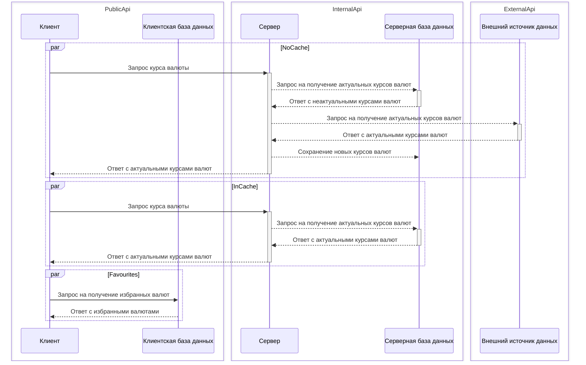

# Структура стажировки

Задания на стажировке состояли из решения 2 кейсов-проблем и творческого задания - создания пет-проекта по указанным требованиям.

Задания-кейсы:

1. Наследование и полиморфизм, методы расширения, бенчмарк поиска (не)интернированных строк, боксинг и копирование структур при передаче в метод.
2. Наследование и полиморфизм, Lazy, обработка исключений, рефлексия.

Пет-проект:

1. Подготовка пет-проекта: middleware, логирование входящих запросов, swagger, IExceptionFilter, IOptions, реализовать получение данных из внешнего API, возвращать эти данные через REST-контроллеры.
2. Подготовка пет-проекта: создание серверной части - кеширующий сервис, HttpClientFactoryService, gRPC, Interceptor (ExceptionInterceptor).
3. Подготовка пет-проекта: база данных - PostgreSQL, индексы, ограничения, схемы базы данных, EF, миграции.
4. Завершение пет-проекта: Docker, внутренняя очередь задач, фоновые задачи (смена базовой валюты кеша и его пересчет).

## Описание PP

Пет-проект представляет собой клиент-серверное приложение для получения курсов валюты, общение между частями происходит через gRPC.

Стек: .NET7,  AutoMapper, Serilog, Audit.NET, Swagger (Swashbuckle), EF Core, PostgreSQL, REST, gRPC, Docker, dotnet-subset.

Сервер: получает курсы валют из внешнего API, кеширует их в PostgresSQL, поддерживает актуальность кеша при запросе.

Клиент: получает курсы валют от серверной части по gRPC, хранит избранные валюты (базовая валюта : запрашиваемая валюта), возвращает пользователю курсы валюты через RESTful API.

Реализовано сверх требований:

* Сервер
  * Настройки сервиса должны храниться в базе данных - реализован провайдер конфигурации из PostgreSQL.
  * InMemoryCache
  * HealthChecks: REST, gRPC
* Клиент
  * HealthCheck: REST
  * AutoMapper для DTO

